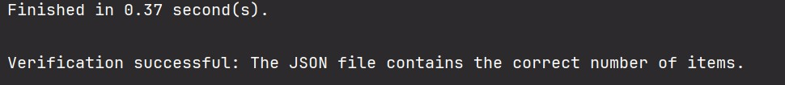

# Post Fetcher Using Threading

This project fetches posts from the [JSONPlaceholder API](https://jsonplaceholder.typicode.com/posts/) and writes
them to a JSON file. It uses threading to fetch posts concurrently, ensuring efficient data retrieval. It also
provides functionality to verify the operation.

## Features

- Fetching of posts from JSONPlaceholder API using threading.
- Writing data to a JSON file in a thread-safe manner.
- Verifying the number of posts written to the file.
- Measuring execution time to ensure performance.

## Requirements

- Python 3.x
- `requests` library

## Usage

1. Clone the repository or download the script.
2. Ensure you have Python 3.x installed.
3. Install the required library:
    ```bash
    pip install requests
    ```
4. Run the script:
    ```bash
    python main.py
    ```

## Project Structure

- `posts.json`: The file where the fetched posts will be saved.
- `main.py`: The main Python script file containing the logic for fetching and writing posts.
- `execution_result.jpg`: Screenshot of the execution time.
- `requirements.txt`: Contains a list of packages or libraries needed to work on the project.
- `README.md`: Project description.

## Performance

The script completes the execution in approximately 0.37 seconds. However, performance may vary 
based on network conditions and system specifications.


