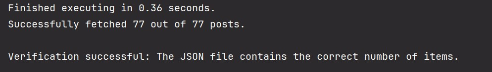

# Asynchronous Post Fetcher #
This project uses Python's `asyncio` library to fetch posts from the JSONPlaceholder API,
and write them to a JSON file. It also provides functionality to verify the operation

## Features ##
- Asynchronous fetching of posts from JSONPlaceholder API.
- Concurrent requests with customizable limit.
- Thread-safe writing to a JSON file.
- Verification of the number of fetched posts.
- Object-Oriented design for easy extensibility.

## Requirements ##

- Python 3.7+
- `aiohttp`
- `aiofiles`

## Usage ##
When you run the script, by default, it will fetch 77 posts with a maximum of 16 concurrent requests 
and save them to `posts.json`. To modify these parameters, edit the `main()` function's `number_of_posts`
and `concurrent_requests`.

## Structure ## 

The **PostFetcher** class encapsulates all the functionality:
- `initialize_json_file()`: Initializes the JSON file with an empty list.
- `append_post_to_file(post)`: Appends a post to the JSON file in a thread-safe manner.
- `get_single_post(session, post_id)`: Fetches a single post from the API.
- `get_all_posts(session)`: Fetches all posts asynchronously.
- `verify_contents_of_file()`: Verifies that the correct number of posts were fetched and saved.
- `run()`: Orchestrates the entire process of fetching, saving, and verifying posts.
- `process_results(results, execution_time)`: Processes and prints the results of the operation.

## Performance ##
On average, this script fetches and saves 77 posts in about 0.36 seconds. 
Performance may vary based on network conditions and system specifications.

